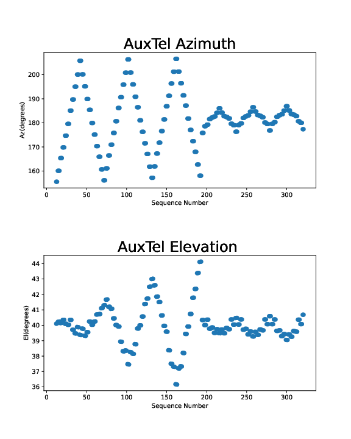
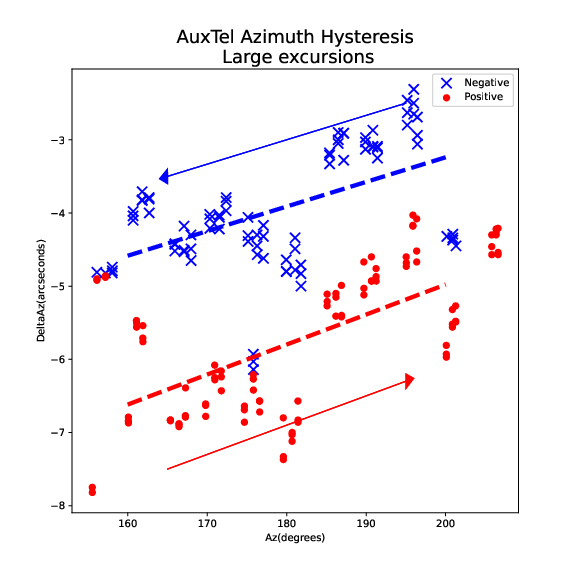

:tocdepth: 1

.. sectnum::

.. Metadata such as the title, authors, and description are set in metadata.yaml

.. TODO: Delete the note below before merging new content to the main branch.

Abstract
========

The Auxiliary Telescope azimuth drive has a hysteresis property where there is a slight shift in the position depending on whether the drive is moving in the positive direction or the negative direction.  This technote shows the measurements and analysis that has been done to quantify this effect.

Introduction
================

In 2019, it was noticed by Mike Warner and others that the azimuth drive of the Auxiliary Telescope had a measurable amount of hysteresis, where the entire drive surface shifted a small amount between traveling in a positive vs a negative direction.  In December, 2022, Patrick Ingraham and Tiago Ribeiro made a series of measurements in an attempt to quantify this effect.  In January, 2023, Craig Lage performed analysis of those images, leading to the conclusion that the magnitude of this effect is approximately 2 arcseconds.  The details are shown in the following sections.

Measurements
================

The figure below shows the azimuth and elevation positions of the images that were taken.  The attempt was to drive the azimuth drive back and forth alternating between positive and negative directions, while the elevation drive was held constant.  In practice, the need to place a star in the center of the field required small changes in the elevation position as well.  Two sequences were taken.  The first sequence has large displacements of the azimuth drive, approximately +/- 30 degrees.  The second sequence had smaller displacements of the azimuth drive, approximately +/- 5 degrees.

**Imaging sequence for the hysteresis characterization**

Analysis process
================

To analyze the images that were taken, the following process was used.  For each image, a basic ISR was applied, and the DM CharacterizeImageTask was used to find the brightest object in the field.  Then the displacement of this image from the center of the CCD was measured and this displacement was rotated into Az/El coordinates. This process was repeated for all of the images in the test, and then the displacements were plotted.  The analysis was done on the RSP at USDF, and the notebook that performed these analyses is available at :

https://github.com/craiglagegit/Notebook_Keeper/blob/main/auxtel_notebooks/AuxTel_Astrometry_Cone_Shift_25Jan23.ipynb

A representative image of the object location and measurement of the displacement is shown in the following figure.

**Representative image showing the brightest star location and displacement from the CCD center.**

Analysis results - Large displacements
=========================================

The summary of the analysis for the large displacements is shown in the following two figures.  The first figure shows the displacement when traveling in opposite directions.  The second figure takes that data, bins the measurements into 5 degree bins, then takes the difference between the averages in the two directions and plots that as a function of azimuth.  Both plots show a hysteresis displacement of about 2 arcseconds.

**Summary plot showing the displacement when traveling in opposite directions.**

**The binned difference of the displacements when traveling in opposite directions.**

Analysis results - Small displacements
======================================

These plots show the same effect, but with the small displacements.  The effect is not as obvious here, and the magnitude of the effect is only about 1 arcsecond.

**Summary plot showing the displacement when traveling in opposite directions.**

**The binned difference of the displacements when traveling in opposite directions.**

Summary
================

The azimuth drive of the Auxiliary Telescope suffers from a hysteresis effect, where the entire drive surface shifts when traveling in a positive direction as opposed to a negative direction.  This probably puts a lower limit of about 2 arcseconds on the pointing accuracy of the telescope.  However,this level is more than adequate for the telescope to be able to perform its function of monitoring sky transparency.

	   
